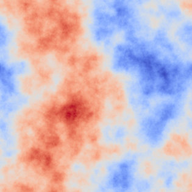

Basic Usage
***********

This section describes how to the simulation for basic cases, that is, using the full end to end code to create and save data which can then be analysed afterwards. Such a scenario is a common one when exploring parameters on conventional AO systems.

Configuration
-------------

In PyAOS, all AO parameters are controlled from the configuration file. This is a python script which contains all the information required to run many AO configurations. A few examples are provided in the ``conf`` directory when you download the code. All parameters are held in one large dictionary, titled ``simConfiguration``, and  are then grouped into relavent sections.

``Sim`` parameters control simulation wide parameters, such as the filename to save data, the number of simulated phase points, the number of WFSs, DMs and Science cameras as well as the name of the reconstructor used to tie them together. The ``filePrefix`` parameters specifies a directory, which will be created if it does not already exist, where all AO run data will be recorderd. Each run will create a new time-stamped directory within the parent ``filePrefix`` one to save run specific data. Data applying to all runs, such as the interaction and control matrices are stored in the ``filePrefix`` directory.

``Atmosphere`` parameters are responsible for the structure of the simulated atmosphere. This includes the number of simulated turbulence layers and the integrated seeing strength, r\ :sub:`0`. Some values in the Atmosphere group must be formatted as a list or array, as they describe parameters which apply to different turbulence layers.

Parameters describing the physical telescope are given in the ``Telescope`` group. These include the telescope and central obscuration diameters, and a pupil mask.

WFSs, LGSs, DMs and Science camera are configured by the ``WFS``, ``LGS``, ``DM`` and ``Science`` parameter groups. As multiple instances of each of these components may be present, every parameters in these groups is represented by either a list or numpy array, where each element specifies that component number. For WFSs and DMs, a ``type`` parameter is also given. This is a the name of the python object which will be used to represent that component, and a class of the same name must be present in the ``WFS.py`` or ``DM.py`` module, respectively. Other WFS or DM parameters may then have different behaviours depending on the type which is to be used.

Each parameter that can be set is described in the :ref:`configuration` section.

Creating Phase Screens
----------------------

For most applications of PyAOS, some randomly generated phase screens are required. These can either be created just before the simulation begins, during the initialisation phase, or some existing screens can be specified for the simulation to use. To generate new phase screens with the parameters specified in ``Atmosphere`` each time the simulation is run, set the ``Atmosphere`` parameter, ``newScreens`` to ``True``. 

If instead you wish to used existing phase screens, provide the path to, and filename of each sreen in the ``screenNames`` parameter as a list. Screens specified to be loaded must be saved as FITS files, where each file contains a single, 2 dimensional phase screen. The simulation will largely trust that the screen parameters are valid, so other parameters in the ``Atmosphere`` group, such as the ``wholeScreenSize``, ``r0`` and ``L0`` may be discounted. If you would like the simulation to be able to scale your phase screens such that they adhere to the ``r0`` and ``screenStrength`` values set in the configuration file, then the FITS file header must contain a parameter ``R0`` which is expressed in units of phase pixels.

Running the Simulation
----------------------

Once all the configuration parameters have been set, and you have decided how whether to load or generate phase screens, the simulation is ready to be run. This can be either from the GUI, the command line or from a script.

Graphical User Interface
^^^^^^^^^^^^^^^^^^^^^^^^

When running PyAOS configurations for the first time it can be a good idea to run them in the GUI to sure that components look to be operating as expected. The GUI is shown below running a simple SCAO case, with a tip-tilt mirror and a stack array DM.

.. image:: imgs/annotatedGUI.png
    :align: center

If pyAOS has been installed, or the ``bin`` directory is in the bash PATH, the GUI is started from the command line with the command::

    pyAOS -g path/to/configFile.py

The ``pyAOS`` script can do a few other things as well, use ``pyAOS --help`` to see all other available options.

Once the GUI has loaded it will begin the initialisation of the simulation. This stage initialises all the simulated components, loads or generates phase screens, allocates data buffers and calculates various required parameters from the parameters given in the configuration file. If any parameters or the configuration file is changed at any point, this initialisation step can be rerun by clicking the "AO Init" button.

The next step in most systems will be to record an interaction matrix, where the effect of each DM influence on the WFS(s) is recorded, and used to calculate a command matrix. From the GUI, this is achieved by clicking the "makeIMat" button. Interaction matrices, command matrices and DM influence functions can be saved in the ``filePrefix`` directory and the simulation checks to see if there are valid ones in that directory it can load instead of making them again. If you would like to force a new interaction matrix to be made, perhaps because you've changed parameters which may effect the new interaction matrix, tick the "Force new?" box.

Once this is complete, you can now click "Run!" to run the simulation. You will now see the atmospheric phase moving across the WFS(s), and the resulting measurements on the WFS. This will be recorded, and transformed to DM commands measurements via the reconstructor, and finally, the science phase will be corrected and a better PSF achieved. The loop gain for each DM can be altered using the spin boxes in the top right of the GUI. 

Using the GUI significantly slows down the simulation operation, but this can be aleviated by limiting the simulation update rate using the top spin box.  

The console in the bottom left of the GUI can be used to either change parameters of the simulation or visualise other data sources. It is a complete python console, provided by the IPython library. To load a new config file into the GUI, go the file>Load Configuration File. You will then have to click "AO Init" to begin initialisation.

Command Line and Scripting
^^^^^^^^^^^^^^^^^^^^^^^^^^

To run the simulation from the command line, either use ::

    pyAOS -i /path/to/configFile.py

which will initialise the simulation before dropping you into an interaction ipython prompt, or simply start or python interpretter of choice and run ::

    import pyAOS                                #Imports python library
    sim = pyAOS.Sim("/path/to/configFile.py")   #Loads the configuration file
    sim.aoinit()                                #Initialises all AO simulated objects

The above code would also be used in scripts to run the simulation.

To measure the interaction matrix run::
    
    sim.makeIMat()

or::

    sim.makeIMat(forceNew=True)

if you'd like to force the creation of interaction matrices, command matrices and DM influence functions.

Once complete, you're now ready to run the simulation with::

    sim.aoloop()

You should now see a rolling counter of the frame number and current Strehl ratio of each science target.

Retrieving Simulation Data
--------------------------

After a simulation run has completed, the resulting data must be retrieved for analysis. The data stored by PyAOS depends on the parameters set in the ``sim`` group in the configuration file. Once a ``aoloop`` has completed, the data will be saved into the ``filePrefix`` directory, in a further, time-stamped directory for that particular run. Whithin the simulation, the data is stored in numpy array structures which can be accessed either after the run has completed or during the run (if it is run in the, or in a python thread on the command line). 

The strehl ratio of each science target is always stored. Internally, it is kept in the arrays::
    
    sim.instStrehl

and::

    sim.longStrehl

Which are the instantaneous and long exposure strehl ratio for each science target. Each of these is of shape ``sim.config.sim.nSci`` by ``sim.config.sim.nIters``. Note that this is even the case for only a single science target, so the science target Strehl ratios is always accessed with ``sim.longStrehl[0]``.
