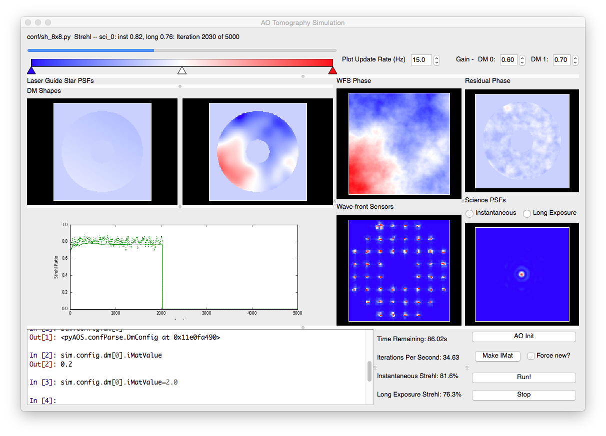

Introduction
************

PyAOS is a Montecarlo Adaptive Optics (AO) simulation written exclusively in the Python programming language. It is aimed at rapidly developing new AO concepts and being a learning tool for those new to the field of AO. 

The code can be used as an end to end simulation, where the entire system parameters are controlled by a configuration file. This can be used from the Python command line, python scripts or a GUI which is included, operation is described in the :ref:`basicUsage` section.

The codes real strength lies in its modular nature. Each AO component is modelled as a Python object, with intuitive methods and attributes. Components can be imported and used separately to create novel AO configurations. Starting with the main :ref:`simulation` module, these are described in detail in this documentation.

Quick-Start
-----------

Try out some of the code examples in the `conf` directory, either run the `pyAOS` script in `bin`, or load a python or IPython terminal::

    import pyAOS
    sim = pyAOS.Sim("configFilename")
    sim.aoinit()
    sim.makeIMat()
    sim.aoloop()

Data will now be saved in the directory specified as `filePrefix` in the configuration file.

Alternatively, the GUI can be started with::

    pyAOS -g <configFilename>

The use the buttons to initialise the simulation, make interaction matrices and run the AO loop. The interactive python console can be used to view data or change parameters

