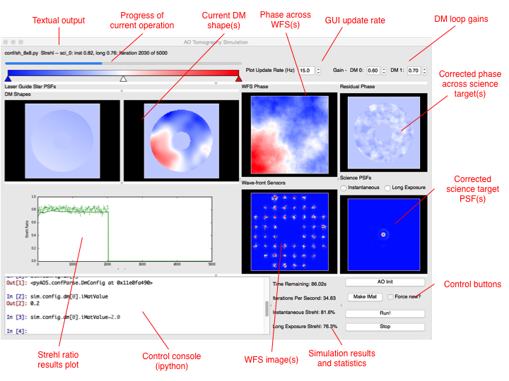

Simple Tutorial
===============

This tutorial will go through some example AO systems using Soapy. We'll see how to make configuration files to run the AO system that you'd like to, then extract data which can be subsequently analysed. CANARY is an AO system on the 4.2m William Herschel Telescope on La Palma. It is designed to be very flexible to run various "modes" of AO, so makes a nice test bed for us to simulate. We'll simulate it in SCAO mode, in GLAO with multiple guide-stars and in SCAO with a LGS.

Running an Example SCAO Configuration
-------------------------------------

Before making new configuration files though, its a pretty good idea to make sure everything is working as expected by running one of the examples. First, lets create a directory where we do this tutorial, call it something like ``soapy_tutorial``, make a further directory called ``conf`` inside and copy the example configuration file ``sh_8x8.yaml`` form the downloaded or cloned Soapy directory into it.

To open the Graphical User Interface (GUI), type in the command line::

    soapy --gui conf/sh_8x8.yaml

This relies on ``soapy`` being in you're ``PATH``. If thats not the case, run::

    python <path/to/soapy>/bin/soapy --gui conf/sh8x8.yaml

You should see a window which looks a bit like this pop up:

If you don't want to run the GUI, then open a python terminal and run::

    import soapy
    sim = soapy.Sim("conf/sh8x8.yaml")

Before the simulation can be started, some initialisation routines must be run. If running the GUI, then this will automatically when you start it up. In the command line, to initialise run::

    sim.aoinit()

Next, the interaction matrixes between the DMs and the WFSs. In the GUI this is achieved by clicking "makIMat", and in the command line with::

    sim.makeIMat()

This simulation will save command matrices, interaction matrices and DM influence functions for a simulation, so that it doesn't alway have to remake them. If you'd like to override the loading them from file and make them from scratch, tick the "force new" button in the GUI, or pass the argument ``forceNew=True`` to the ``makeIMat`` command.

To actually run the simulation, click "aoloop" in the GUI, or type::

    sim.aoloop()

at the command line. This will run the simulation for the configured number of iterations, and estimate the performance of the specified AO system.

Creating a new SCAO configuration file
--------------------------------------

Now the simulation is working, lets start to simulate CANARY. We'll use the ``sh_8x8.yaml`` configuration file as a template. Copy it to another file called ``CANARY_SCAO.yaml``,  and open this file in your favourite text editor. The configuration file contains all the parameters which determine the configuration of the simulated AO system. All the parameters are held in a YAML configuration file and parameters are grouped into sub-dictionaries depending on which components they control. Descriptions of all possible parameters are given in the :ref:`configuration` section.

``Sim`` Parameters
^^^^^^^^^^^^^^^^^^

The first of these groups are parameters are those which have a system wide effect, so-called ``Sim`` parameters. They should have no indendation in the YAML file.

The first parameter to change is the ``simName``, this is the directory where data will be saved during and after an AO run. Set it to ``CANARY_SCAO``. The ``logFile`` is the filename of a log which records all text output from the simulation, set it to ``CANARY_SCAO.log``. The value of ``loopTime`` specifies the frame rate of the simulation, which is usually, though not always, also the frame rate of the WFSs and DMs. More accurately though, it is the time between movements of the atmosphere. For CANARY, make the system run at 200Hz, so set this to ``0.005``. For the purposes of this tutorial, lets also set the number of iterations which will be run, ``nIters`` to around 500 so that it will run quickly.

The ``Sim`` group also contains parameters which determine the data which will be stored and saved from the simulation. Set values to ``True`` if you'd like them to be continually saved in a memory buffer before being written to disk in a AO run specific, time-stamped directory within the ``simName`` directory.

``Atmosphere`` Parameters
^^^^^^^^^^^^^^^^^^^^^^^^^

As would be expected, this group of parameters describe the nature of the atmospheric turbulence. Currently, this configuration file features an atmosphere with 4 discrete turbulence layers, increase that to 5 by setting ``scrnNo`` to ``5``.  The ``r0`` parameter is the Fried parameter in metres and controls the integrated seeing strength, set this to ``0.14``. ``screenHeights``, ``scrnStrengths``, ``windDirs`` and ``windSpeed`` control the layer heights, relative C\ :sub:`N`\ :sup:`2` strengths, wind directions and wind velocities. These must be formatted as a list at least as long as ``scrnNo``, so add another value to each.

Phase screens can be either created on each simulation run, or can be loaded from file. To load screens from file a parameter, ``scrnNames``, must be set with the filename of each phase screen in a list.

``Telescope`` Parameters
^^^^^^^^^^^^^^^^^^^^^^^^
The diameter of the simulated telescope and its central obscuration are determined by the ``telDiam`` and ``obsDiam`` parameters in the ``Telescope`` parameters. The ``mask`` value determines the shape if the pupil mask. If set to ``circle``, this will simple be a circular telescope pupil, with a circular obscuration cut out the centre. If something more complex is desired, this value should be set to filename of 2-d fits file with shape ``(sim.pupilSize, sim.pupilSize)``, set to ``0`` at opaque parts of the pupil and ``1`` at transparent parts.

CANARY is hosted by the WHT, which is a 4.2 metre diameter telescope with a central obscuration of approximately 1.2 metres. Set these values, and keep ``mask`` set to ``circle``.

``WFS`` Parameters
^^^^^^^^^^^^^^^^^^
Each WFS must be specified seperately, with an index or 0, 1, 2...etc. Set ``nxSubaps``, the number of Shack-Hartmann sub-apertures in a single dimension to ``7`` and  ``pxlsPerSubap`` to ``14``. The pixel scale is defined by the parameter ``subapFOV``, which is actually the FOV of the entire sub-aperture, set this to ``2.5``.

``DM`` Parameters
^^^^^^^^^^^^^^^^^

As with ``WFS`` parameters, each DM is specified seperately, with an integer index. There must be at least ``sim.nDM``s specified. The first DM will be a Tip-tilt mirror, hence the ``type`` is set to ``TT``.  The second is a higher spatial order stack array type denoted in the simulation as ``Piezo``. These names correspond to classes which are defined in the ``DM.py`` module. Set the number of actuators in one dimension to 8, by setting the second value in ``nxActuators`` to ``8``.

``Science`` Parameters
^^^^^^^^^^^^^^^^^^^^^^

The final group of parameters which define the simulation are the ``Science`` parameters which define the science targets and detectors to be used to measure AO performance. Again, multiple science cameras can be specified, so each requires an index. There must be at least ``sim.nSci`` science cameras specified. Change the Field of View of the science detector by setting ``FOV`` to ``3.0``.

Run it!
^^^^^^^
Run the simulation as before, either in the GUI or in the command line with either::

    soapy --gui conf/CANARY_SCAO.yaml

click makeIMat
click aoloop

or::

    import soapy
    sim = soapy.Sim("conf/CANARY_SCAO.yaml")
    sim.makeIMat()
    sim.aoloop()

The resulting Strehl ratio should be around 0.65, though there will be some variation due to the random generation of the phase screens.

Examining data and changing parameters
--------------------------------------

Once a simulation has been completed, the task then turns to extracting an analysing the resulting data. Many data sources can be saved from Soapy, they are listed in :ref:`dataSources`. Whether they are saved or not is a result of the parameters set in the ``Sim`` section. If so, they will be saved to a directory of ``<simName>/<timestamp>/`` in the FITS standard format. They can also be accessed from the simulation object using ``sim.<dataSource>``. For example, to plot the long exposure Strehl ratio recorded on the first science detector over the course of the simulation, type either in a command line or in the GUI terminal::

    from matplotlib import pyplot
    pyplot.plot(sim.longStrehl[0])
    pyplot.show()

The first science detector image can be retrieved with::

    imshow(sim.sciImgs[0])

and the measurements recored on all WFSs with::

    imshow(sim.allSlopes)

The parameters which were originally defined in the configuration file can also be accessed and altered. The variables holding the parameters have the same name as the configuration file parameters, though the names of the groups may be shortened. Assuming that the simulation object is called ``sim`` (as in this tutorial), any configuration parameter can be access with::

    sim.config.<configGroup>.<param>

So to check or change the ``pupilSize`` parameter, one could do the following::

    print(sim.config.sim.pupilSize)
    sim.config.sim.pupilSize = 256

For the parameter groups ``WFS``, ``DM`` and ``Science``, which are set as lists, access of the parameter for item ``n`` is through ``sim.config.wfss[n].<param>``, ``sim.config.dms[n].<param>`` and ``sim.config.scis[n].<param>``. For example, to check, then change the 1st WFS centroiding method::

    print(sim.config.wfss[0].centMethod)
    sim.config.wfss[0].centMethod = "simple"

or to set the number of DM actuators on the high order DM::

    print(sim.config.dms[1].nxActuators)
    sim.config.dms[1].nxActuators[1] = 16

After changing these values, click aoinit or type ``sim.aoinit``, then makeImat or ``sim.makeIMat()`` and finally aoloop or ``sim.aoloop`` to run the simulation and observe the effect of the change parameters. Some parameters can be changed while the simulation is running. This is useful when using the GUI and optimising parameters for an AO system. Parameters which are safe to change during AO operation are denoted in the :ref:`configuration` section with \** at the end of the parameter description.

GLAO Example
------------

CANARY is an experimental AO system which has been designed to explore tomographic AO. As such it would be thoroughly rude not to simulate it in a tomographic configuration. As tomographic AO often involves complex reconstructors out of the scope of this tutorial, it shall be run in the simplest tomographic case, Ground Layer AO (GLAO). This is where the measurements of several WFSs observing off-axis are effectively averaged, which corrects well when the WFS field of views overlap, such as at low-layers, but not so well when they have diverged, such as at high layers. This mode of AO can be performed using the ``MVM`` reconstructor used previously without modification.

Copy the ``CANARY_SCAO`` configuration file to another file name ``CANARY_GLAO``. The only parameters which require changing are the number and position of WFSs. In the ``Simulation`` group set ``nGS`` to ``3``. Copy the first WFS set of parameters and paste them below it twice. Change the index, currently set at ``0`` to ``1`` and ``2`` respectively. The ``GSPosition`` values may be set to an asterism such as ``[0, 30]``, ``[-24.5, -25]``, ``[24.5, -15]`` which forms a triangle around the science target.

Run this new configuration file. The AO performance should have decreased significantly as only the lowest turbulence layer will be corrected effectively, but extra off-axis science targets would show that the performance is more consistent across a wide-field.
